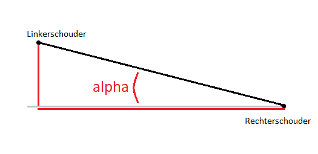
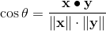
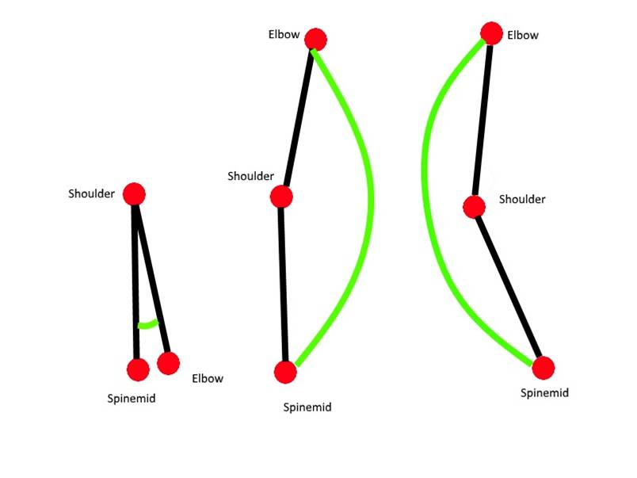
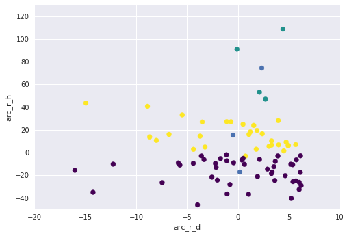
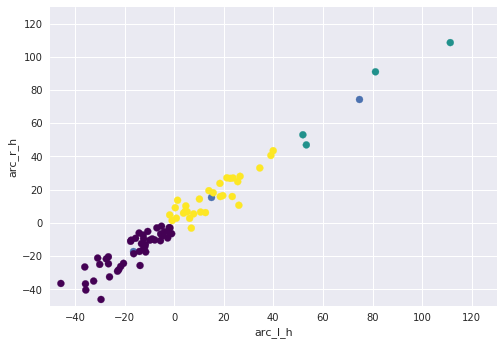

TODO controleren links


# Portfolio KB74
Welkom op mijn portfolio, gemaakt voor de KB74 minor. Tijdens deze minor ben ik groepslid van de groep Pepper. Deze groep doet onderzoek naar het gebruik van 3D-camera's in de zorg. Concreter: kan een fysiotherapeut gebruik maken van een 3D-camera bij het bepalen van painful arcs bij patiënten?


# In mijn portfolio

- [Opdrachten](#opdrachten) 
    - [Datacamp](##datacamp)
    - [Coursera](##coursera)
    - [Exploratory Data Analysis](##exploratory-data-analysis) 
    - [Spark Assignments](##spark-assignments)
- [Literatuur](#literatuur) 
- [Opnames Atrium](#opnames-atrium) 
- [Visualisatie](#visualisatie) 
    - [Dieptebeelden](##dieptebeelden) 
    - [Grafieken](##grafieken) 
        - [Excel](###excel)
        - [Python](###python)
- [Wiskunde](#wiskunde)
- [Zwakke plekken](#zwakke-plekken)
    - [Ruggengraat](##ruggengraat)
    - [Plaatsing van joints](##plaatsing-van-joints)
- [Clustering](#clustering) 
- [Presentaties](#presentaties) 
- [Andere taken](#andere-taken)


# Opdrachten

## Datacamp
Op Datacamp heb ik de volgende courses gevolgd:
- Intro to Python for Data Science 
- Intermediate Python for Data Science
- Introduction to visualization with Python 
- Importing data in Python path 1 
- Python Data Science Toolbox (Part 1)
- Pandas foundation
- Python Data Science Toolbox (Part 2)
- Introduction to data visualization with Python
- Cleaning Data
- Statistical Thinking in Python (part 1)
- Supervised Learning with Skicit-learn

Screenshots: [zie](images/DataCamp1.png) en [zie](images/DataCamp2.png)

## Coursera
Op Coursera heb ik de volgende courses gevolgd:
- Machine Learning - Linear Regression with One Variable ([zie screenshot](images/Coursera1.png))
- Machine Learning - Linear Regression with Multiple Variables ([zie screenshot](images/Coursera2.png))
- Machine Learning - Logistic Regression & Regularization ([zie screenshot](images/Coursera3.png))
- Machine Learning - Advice for Applying Machine Learning ([zie screenshot](images/Coursera6.png))

## Exploratory Data Analysis

| Nr. | Naam |
| --- | --- |
| 1 | [Check Data Edges](notebooks/1CheckDataEdges.md) |
| 2 | [Variable Identification](notebooks/2VariableIdentification-Codebook.md) |
| 3 | [Univariate Analysis](notebooks/3UnivariateAnalysis.md) |
| 4 | [Bi-variate Analysis](notebooks/4Bi-variateAnalysis.md) |
| 5, 6 | [Missing data and outliers](notebooks/5+6MissingDataOutliers.md) |
| 7 | [Transformation](notebooks/7Transformation.md) |
| 8 | [Variable creation](notebooks/8Variablecreation.md) |
| 9 | [Evaluation](notebooks/9Evaluation.md) |

## Spark Assignments

| Nr. | Naam |
| --- | --- |
| 1 | [Assignment 1](notebooks/assignment1.md) |
| 2 | [Assignment 2](notebooks/assignment2.md) |


# Literatuur
De [samenvattingen](documents/Samenvattingen.md) die ik gemaakt heb.


# Opnames Atrium
Poster ter informatie voor studenten.


Impressie van de opnames.


# Visualisatie

## Dieptebeelden
Eerste dieptebeelden gemaakt met de Intel Realsense camera omgezet in grijswaarden. Gezocht naar een range van afstanden waarbinnen de persoon staat, en deze omgezet in grijswaarden.


## Grafieken

### Excel
Na het werkend krijgen van de RealSense camera die gebruikt wordt in de Pepper robot, hebben we de eerste data verkregen. Deze data heb ik geïmporteerd in Excel. Door tabellen te genereren heb ik geprobeerd de beweging te visualiseren. 


### Python
Tegen de tijd dat we gingen werken met de Jupyterhub, en dus Python gingen gebruiken, hadden we al besloten verder te gaan met de Kinect data. De grafieken hieronder zijn dus gemaakt met data van de Kinect.

In de eerste grafiek zijn de hoeken van de arm weergegeven voor één persoon, terwijl een zijwaartse beweging werd gemaakt (exercise 1).


In de tweede grafiek zijn de hoeken van de arm weergegeven voor vijf personen, bij het maken van dezelfde beweging als voorgaande grafiek.


# Wiskunde
### Normalisatie
Voor elke exercise neem ik de volgende stappen om de tijd te normaliseren:
1. Eerste frame op 0 seconden zetten en vervolgens voor elk volgend frame het verschil met het vorige frame berekend en deze cumulatief opgeteld.
2. Voor elk frame deel ik het aantal seconden door het aantal seconden van het laatste frame.
In code ziet dit er als volgt uit: [toon code.](notebooks/Normalization.md)


### Rotatie lichaam
Om de verschillende hoeken tussen de arm en het lichaam goed te berekenen, is het van belang dat het lichaam 'recht voor de camera' staat. Omdat niet iedereen tijdens het maken van de opnames recht voor de camera stond, heb ik code geschreven die de lichamen recht zet. Dit doe ik aan de hand van de volgende stappen:
1. Allereerst zet ik de x- en z-coördinaten van de rechterschouder in de oorsprong, waarna ik alle andere lichaamspunten (joints) met dezelfde translatie verplaats.
2. Vervolgens bepaal ik de hoek alpha met behulp van de formule tan(alpha) = overstaande zijde/aanliggende zijde. Dit is weergegeven in de volgende afbeelding: 
3. Daarna roteer ik alle punten met de gegeven hoek, met behulp van de rotatiematrix.


### Hoeken berekenen 
Wanneer het lichaam recht staat, kan de gewenste hoek tussen arm en lichaam berekend worden. Dit wordt berekend met behulp van de formule:



De vectoren worden gecreëerd met de coördinaten van de benodigde joints. De code die ik hiervoor geschreven heb staat hieronder. Zichtbaar in de code is dat er drie verschillende hoeken berekend moeten worden, afhankelijk van de oefening die de persoon doet (oefening 1, 2 of 3).

``` python
def calculate_arc(frame, eNum, side):  
    een = [1, 4, 5]
    twee = [2, 6, 7]
    drie = [3, 8, 9]
    
    # which exercise is done in the given dataframe
    if (eNum in een) or (eNum in twee):
        # which coördinate is needed for the desired arc
        if eNum in een:
            coordinate_one = 'xRotated'
            coordinate_two = 'y'
        elif eNum in twee:
            coordinate_one = 'y'
            coordinate_two = 'zRotated'
       
        # create vector
        spineShoulder = np.matrix([[frame.loc[frame['jointName'] == 'SpineShoulder', coordinate_one].values[0]], 
                               [frame.loc[frame['jointName'] == 'SpineShoulder', coordinate_two].values[0]]])
        spineMid = np.matrix([[frame.loc[frame['jointName'] == 'SpineMid', coordinate_one].values[0]], 
                               [frame.loc[frame['jointName'] == 'SpineMid', coordinate_two].values[0]]])
        spineMid_new = spineMid - spineShoulder
        
        if side == 'l':
            # left side
            jointName_shoulder = "ShoulderLeft"
            jointName_elbow = "ElbowLeft"
        elif side == 'r':
            # right side
            jointName_shoulder = "ShoulderRight"
            jointName_elbow = "ElbowRight"
        
        # create vector
        shoulder = np.matrix([[frame.loc[frame['jointName'] == jointName_shoulder, coordinate_one].values[0]], 
                        [frame.loc[frame['jointName'] == jointName_shoulder, coordinate_two].values[0]]])
        elbow = np.matrix([[frame.loc[frame['jointName'] == jointName_elbow, coordinate_one].values[0]], 
                        [frame.loc[frame['jointName'] == jointName_elbow, coordinate_two].values[0]]])
        elbow_new = elbow - shoulder
        
        # calculation
        sum_vectors = np.dot(np.transpose(spineMid_new), elbow_new)
        multiplication_lengths = np.linalg.norm(spineMid_new) * np.linalg.norm(elbow_new)
        
    else:
        if side == 'r':
            # right side
            jointName_elbow = "ShoulderRight"
            jointName_wrist = "WristRight"
        else:
            # left side
            jointName_elbow = "ShoulderLeft"
            jointName_wrist = "WristLeft"
          
        # create vector
        elbow = np.matrix([[frame.loc[frame['jointName'] == jointName_elbow, 'xRotated'].values[0]], 
                            [frame.loc[frame['jointName'] == jointName_elbow, 'zRotated'].values[0]]])
        wrist = np.matrix([[frame.loc[frame['jointName'] == jointName_wrist, 'xRotated'].values[0]], 
                            [frame.loc[frame['jointName'] == jointName_wrist, 'zRotated'].values[0]]])
        
        wrist_new = wrist - elbow
        front_vector = np.matrix([[0],[-1]])
        
        # calculation
        sum_vectors = np.dot(np.transpose(front_vector), wrist_new)
        multiplication_lengths = np.linalg.norm(front_vector) * np.linalg.norm(wrist_new)
    
    # calculation
    cos_alpha = sum_vectors / multiplication_lengths
    alpha = np.arccos(cos_alpha) * 180 / math.pi
    
    # when a person can move his arm more than 180 degrees
    if eNum in een:
        if side == 'r':
            if elbow_new[0,0] < spineMid_new[0,0]:
                alpha = 360 - alpha
        else:
            if elbow_new[0,0] > spineMid_new[0,0]:
                alpha = 360 - alpha
    elif eNum in twee:
        if (elbow_new[0,0] > 0) and (elbow_new[1,0] > 0): 
            alpha = 360 - alpha
                
    return alpha        
```


# Zwakke plekken
We maken gebruik van een bestaand algoritme om een skelet te creëren. Dit skelet bestaat uit 25 joints, die elk (onder andere) een x-, y- en z-coördinaat bevatten. Met deze coördinaten worden vervolgens alle hoeken berekend voor de data analyse. Het is van belang dat de coördinaten juist zijn, anders kloppen de berekende hoeken niet. In de meeste gevallen lijken de coördinaten te kloppen, op een aantal momenten is dit echter niet zo.  

## Ruggengraat
De hoek tussen de arm en het lichaam bij de voorwaartse beweging wordt berekend aan de hand van de arm en de ruggengraat. De ruggengraat bestaat uit een aantal punten, waaronder SpineShoulder en Spinemid. De coördinaten van deze punten wordt gebruikt om de richting van de ruggengraat te bepalen (de ene vector voor de hoekberekening). In bijna alle gevallen zijn de coördinaten goed genoeg om een realistische berekening te maken. Echter gaat het fout bij personen met een dikke buik. De ruggengraat wordt dan door het algoritme schuin naar voren geplaatst, zoals is weergegeven in de afbeelding hieronder. Dit heb ik samen met Boris ontdekt en getest door zelf een dikke buik te creëren, en dit te vergelijken met dezelfde persoon zónder dikke buik.



## Plaatsing van joints
Een iets meer zichtbare 'zwakke plek' van het algoritme is de plaatsing van de joints in bepaalde situaties. Bijvoorbeeld wanneer de persoon zijn armen recht omhoog langs zijn hoofd heeft. Op dit moment is het algoritme niet altijd in staat goed onderscheid te maken tussen het hoofd, de nek en de schouders. Ook de heupen zijn te hoog geplaatst. Een voorbeeld hiervan is zichtbaar in de volgende afbeelding: TODO afbeelding.


# Clustering
Om inzicht te krijgen in de samenhang tussen variabelen heb ik me met Boris beziggehouden met clustering. We hebben gewerkt met het K-means algoritme. Eerst heb ik een klein voorbeeld bekeken en geprobeerd in Python, zie [code](notebooks/Kleine_oefening.md). Daarna heb ik samen met Boris is de data geprepareerd om het bruikbaar te maken voor het K-means algoritme, zie [code](notebooks/Input_data.md). Vervolgens hebben we de data van ons onderzoek geclusterd. De resultaten zijn als volgt:

## Hoeken hoogte en diepte - exercise 1 ([code](notebooks/Cluster_real_data.md))
Voor deze clustering hebben we gekeken naar data van de eerste oefening. We hebben voor alle personen op t = 0,3 (van de genormaliseerde tijd) berekend welke hoek hun arm op dat moment maakt en wat de z-waarde (de diepte) op dat moment is. Vervolgens hebben we voor iedereen de afwijking bepaald ten opzichte van het gemiddelde, voor zowel de hoek als de diepte. Hier zijn we mee gaan clusteren. De resultaten hiervan zijn weergegeven in onderstaande grafieken. 


*Grafiek van linkerarm, met op de x-as de diepte (z-coördinaat) en op de y-as de hoek tussen de arm en het lichaam*



*Grafiek van rechterarm, met op de x-as de diepte (z-coördinaat) en op de y-as de hoek tussen de arm en het lichaam*



*Grafiek van de hoek van beide armen, met op de x-as de linkerarm en op de y-as de rechterarm*


*Grafiek van de diepte van beide armen, met op de x-as de linkerarm en op de y-as de rechterarm*


## Diepte bij bepaalde hoek - exercise 1
Om personen met elkaar te vergelijken, hebben we vervolgens niet naar een bepaalde genormaliseerde tijd gekeken, maar naar een bepaalde hoek. Bij deze hoek hebben we voor elke persoon de diepte bepaald, en deze hebben als parameter toegevoegd aan de clustering. De resultaten hiervan zijn weergegeven in de volgende grafieken. 


*Grafiek van de diepte van de elleboog bij een hoek van 40 graden tussen arm en lichaam, met op de x-as de diepte van de linker elleboog en op de y-as van de rechter elleboog*

Zichtbaar in de grafiek is in ieder geval dat de diepte van de beide armen minder symmetrisch is, omdat de punten niet allemaal dicht op de diagonale lijn liggen.

# Presentaties

| Nr. | Intern/Extern | Presentatie |
| --- | --- | --- |
| 1 | Extern | [presentatie](presentations/Presentatie_1_extern.pdf) |
| x | LUMC | TODO |


# Andere taken

## Wiskunde sessie's
De volgende wiskunde sessie's heb ik gegeven aan studenten van de minor:

| Nr. | Onderwerpen | Presentatie
| --- | --- | --- |
| 1 | Variable, function, first order functions, gradient, intercept | [presentatie](presentations/math_behind_ml_1.pdf) |
| 4 | Gradient descent, derivative, learning rate, update rules, batch gradient descent | [presentatie](presentations/math_behind_ml_4.pdf) |
| 10 | Polynomial regression and the normal equation | [presentatie](presentations/math_behind_ml_10.pdf) |


## Notebooks
- [algoritmes, eerste versie](notebooks/Combined_to_plot.ipynb)
- [functies voor "treintje"](notebooks/Seperated_functions.md)
- [functies voor "treintje" v2](notebooks/Seperated_functions_v3.md) 


## Andere taken
- mailcontact met opdrachtgever Eric Vermeulen van het LUMC
    - nieuwe afspraken maken
    - voortgang
- contactpersoon lector Erwin de Vlugt bij afwezigheid Tony Andrioli
- meegewerkt aan voorstel voor Medisch Ethische Commissie
- meegewerkt aan protocol voor maken opnames
- invoeren formulieren van opnames Atrium
- template artikel uitgewerkt en aangepast naar onze opzet in LaTeX 
- presentatie onderzoek in het LUMC op 6 februari (na einde minor)
