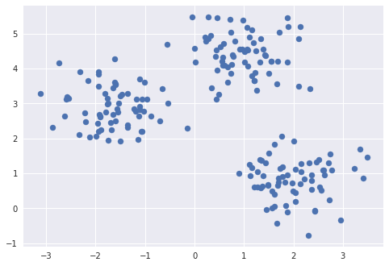
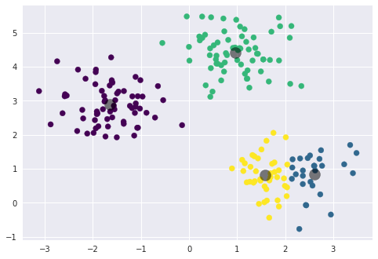

```python
import pandas as pd
import seaborn as sns
import matplotlib.pyplot as plt

max_arcs = pd.read_csv('max_arcs.csv')
ages = pd.read_csv('ages.csv')
```


```python
data = pd.concat([ages.age, max_arcs.max_arc_right], axis=1)
data.plot.scatter(x='age', y='max_arc_right', ylim=(0,200))
plt.show()
```

    /opt/jupyterhub/anaconda/lib/python3.6/site-packages/matplotlib/font_manager.py:1316: UserWarning: findfont: Font family ['sans-serif'] not found. Falling back to DejaVu Sans
      (prop.get_family(), self.defaultFamily[fontext]))





```python
data = pd.concat([ages.age, max_arcs.max_arc_left], axis=1)
data.plot.scatter(x='age', y='max_arc_left', ylim=(0,200))
plt.show()
```

    /opt/jupyterhub/anaconda/lib/python3.6/site-packages/matplotlib/font_manager.py:1316: UserWarning: findfont: Font family ['sans-serif'] not found. Falling back to DejaVu Sans
      (prop.get_family(), self.defaultFamily[fontext]))


```python
max_arcs.info()
ages.info()
```

    <class 'pandas.core.frame.DataFrame'>
    RangeIndex: 61 entries, 0 to 60
    Data columns (total 4 columns):
    Unnamed: 0       61 non-null int64
    pNum             61 non-null float64
    max_arc_right    61 non-null float64
    max_arc_left     61 non-null float64
    dtypes: float64(3), int64(1)
    memory usage: 2.0 KB
    <class 'pandas.core.frame.DataFrame'>
    RangeIndex: 61 entries, 0 to 60
    Data columns (total 3 columns):
    Unnamed: 0    61 non-null int64
    pNum          61 non-null int64
    age           61 non-null int64
    dtypes: int64(3)
    memory usage: 1.5 KB


```python
decades = ages.age.map(lambda x: x - x % 10)
data = pd.concat([decades, max_arcs.max_arc_left], axis=1)
f, ax = plt.subplots(figsize=(8,6))
fig = sns.boxplot(x='age', y='max_arc_left', data=data)
fig.axis(ymin=0,ymax=170)
plt.show()
```

    /opt/jupyterhub/anaconda/lib/python3.6/site-packages/matplotlib/font_manager.py:1316: UserWarning: findfont: Font family ['sans-serif'] not found. Falling back to DejaVu Sans
      (prop.get_family(), self.defaultFamily[fontext]))




