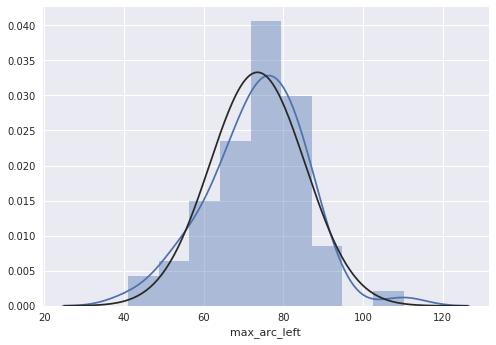
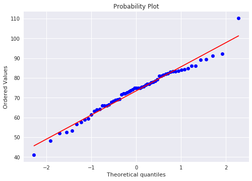
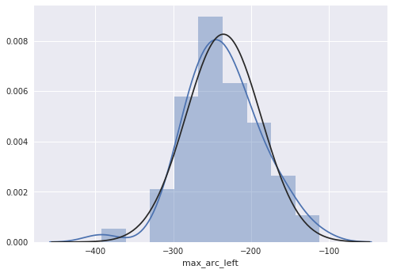
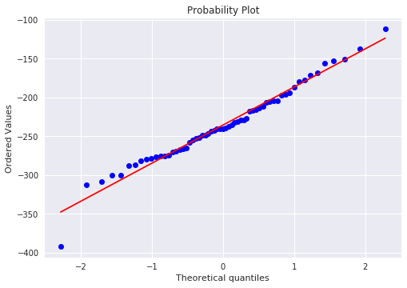
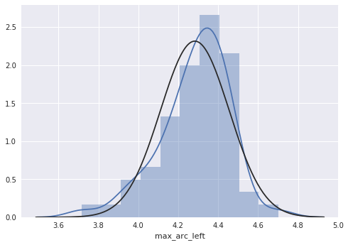
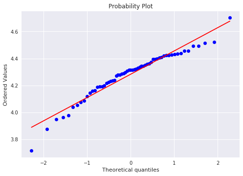

```python
import pandas as pd
import seaborn as sns
import matplotlib.pyplot as plt
import scipy as sc

max_arcs = pd.read_csv('max_arcs.csv')
ages = pd.read_csv('ages.csv')
```

# No transformation


```python
sns.distplot(max_arcs.max_arc_left, fit = sc.stats.norm)
fig = plt.figure()
res = sc.stats.probplot(max_arcs.max_arc_left, plot=plt)
plt.show()
```

    /opt/jupyterhub/anaconda/lib/python3.6/site-packages/matplotlib/font_manager.py:1316: UserWarning: findfont: Font family ['sans-serif'] not found. Falling back to DejaVu Sans
      (prop.get_family(), self.defaultFamily[fontext]))








# Boxcox transformation


```python
sc.stats.boxcox(max_arcs.max_arc_left)[1]
```


    1.2698688452444955


```python
copy_max_arcs = max_arcs.copy()
copy_max_arcs.max_arc_left = -copy_max_arcs.max_arc_left ** 1.27
```


```python
sns.distplot(copy_max_arcs.max_arc_left, fit = sc.stats.norm)
fig = plt.figure()
res = sc.stats.probplot(copy_max_arcs.max_arc_left, plot=plt)
plt.show()
```

    /opt/jupyterhub/anaconda/lib/python3.6/site-packages/matplotlib/font_manager.py:1316: UserWarning: findfont: Font family ['sans-serif'] not found. Falling back to DejaVu Sans
      (prop.get_family(), self.defaultFamily[fontext]))








# Log transformation


```python
import numpy as np
copy_max_arcs1 = max_arcs.copy()
copy_max_arcs1.max_arc_left = np.log(copy_max_arcs1.max_arc_left)
```


```python
sns.distplot(copy_max_arcs1.max_arc_left, fit = sc.stats.norm)
fig = plt.figure()
res = sc.stats.probplot(copy_max_arcs1.max_arc_left, plot=plt)
plt.show()
```

    /opt/jupyterhub/anaconda/lib/python3.6/site-packages/matplotlib/font_manager.py:1316: UserWarning: findfont: Font family ['sans-serif'] not found. Falling back to DejaVu Sans
      (prop.get_family(), self.defaultFamily[fontext]))







