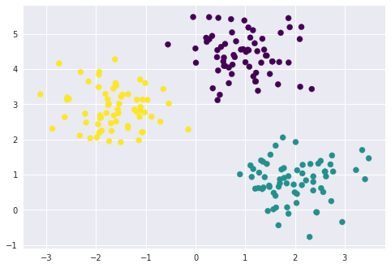

# Cluster algoritme


```python
%matplotlib inline
import matplotlib.pyplot as plt
import seaborn as sns; sns.set()  # for plot styling
import numpy as np
import pandas as pd
from IPython.display import display

from sklearn.metrics import pairwise_distances_argmin

def find_clusters(X, n_clusters, rseed=2):
    # 1. Randomly choose clusters
    rng = np.random.RandomState(rseed)
    print(rng)
    i = rng.permutation(X.shape[0])[:n_clusters]
    centers = X[i]
    
    while True:
        # 2a. Assign labels based on closest center
        labels = pairwise_distances_argmin(X, centers)
        
        # 2b. Find new centers from means of points
        new_centers = np.array([X[labels == i].mean(0)for i in range(n_clusters)])
        
        # 2c. Check for convergence
        if np.all(centers == new_centers):
            break
        centers = new_centers
    
    return centers, labels
```

# Inlezen geprepareerde data


```python
df = pd.read_csv('arcs_to_cluster_deviation_2.csv')
```


```python
from sklearn.cluster import KMeans
inertias = []
print(list(df))
for k in range(3,4):
    df_1 = df.loc[df['nTime'] == 0.3]
    df_2 = df_1.iloc[:,4:]
    kmeans = KMeans(n_clusters=k, random_state=0).fit(df_2)
#     inertias = inertias + [kmeans.inertia_]
    print(kmeans.labels_)
    print(kmeans.cluster_centers_)
    
# print(inertias)

# plt.plot(range(1,9), inertias)
# plt.show()
```

    ['Unnamed: 0', 'pNum', 'eNum', 'nTime', 'arc_l_d', 'arc_l_h', 'arc_r_d', 'arc_r_h']
    [2 0 2 0 2 0 1 0 0 2 0 0 0 0 2 2 2 0 0 2 0 2 2 0 2 2 2 0 0 0 0 0 2 0 0 0 0
     0 2 0 0 0 2 1 1 2 0 2 2 0 0 2 0 2 2 2 0 2 0 0 2 2 0 0 0 2 2 0 1 2 0 0 0 0
     0 0 0 2 0]
    [[ -0.24700791 -16.45440135   0.14883564 -16.96135774]
     [  0.52385524  74.45193304   2.28258972  74.84955398]
     [  0.3006645   14.75467763  -0.52759876  15.46209608]]


# Grafieken plotten met uitkomsten


```python
plt.scatter(kmeans.cluster_centers_[:,0], kmeans.cluster_centers_[:,1])
plt.scatter(df_2['arc_l_d'], df_2['arc_l_h'], c=kmeans.labels_, cmap='viridis')
plt.xlabel('arc_l_d')
plt.xlim([-20, 10])
plt.ylabel('arc_l_h')
plt.ylim([-50, 130])
plt.show()

plt.scatter(kmeans.cluster_centers_[:,2], kmeans.cluster_centers_[:,3])
plt.scatter(df_2['arc_r_d'], df_2['arc_r_h'], c=kmeans.labels_, cmap='viridis')
plt.xlabel('arc_r_d')
plt.xlim([-20, 10])
plt.ylabel('arc_r_h')
plt.ylim([-50, 130])
plt.show()

plt.scatter(kmeans.cluster_centers_[:,1], kmeans.cluster_centers_[:,3])
plt.scatter(df_2['arc_l_h'], df_2['arc_r_h'], c=kmeans.labels_, cmap='viridis')
plt.xlabel('arc_l_h')
plt.xlim([-50, 130])
plt.ylabel('arc_r_h')
plt.ylim([-50, 130])
plt.show()

plt.scatter(kmeans.cluster_centers_[:,0], kmeans.cluster_centers_[:,2])
plt.scatter(df_2['arc_l_d'], df_2['arc_r_d'], c=kmeans.labels_, cmap='viridis')
plt.xlabel('arc_l_d')
plt.xlim([-20, 10])
plt.ylabel('arc_r_d')
plt.ylim([-20, 10])
plt.show()
```

    /opt/jupyterhub/anaconda/lib/python3.6/site-packages/matplotlib/font_manager.py:1316: UserWarning: findfont: Font family ['sans-serif'] not found. Falling back to DejaVu Sans
      (prop.get_family(), self.defaultFamily[fontext]))





