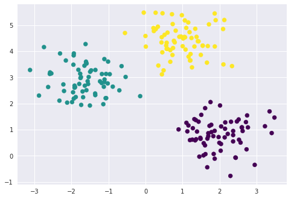
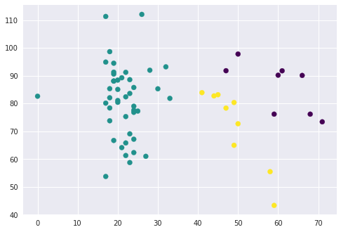
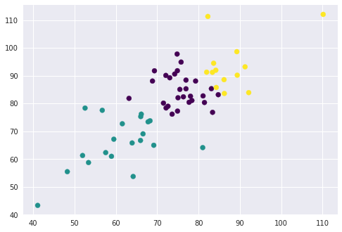

# Code van internet begrijpen


```python
%matplotlib inline
import matplotlib.pyplot as plt
import seaborn as sns; sns.set()  # for plot styling
import numpy as np
import pandas as pd
```


```python
from sklearn.datasets.samples_generator import make_blobs
X, y_true = make_blobs(n_samples=200, centers=3,
                       cluster_std=0.60, random_state=0)
plt.scatter(X[:, 0], X[:, 1], s=50);
```

    /opt/jupyterhub/anaconda/lib/python3.6/site-packages/matplotlib/font_manager.py:1316: UserWarning: findfont: Font family ['sans-serif'] not found. Falling back to DejaVu Sans
      (prop.get_family(), self.defaultFamily[fontext]))


```python
from sklearn.cluster import KMeans
kmeans = KMeans(n_clusters=4)
kmeans.fit(X)
y_kmeans = kmeans.predict(X)
```


```python
plt.scatter(X[:, 0], X[:, 1], c=y_kmeans, s=50, cmap='viridis')

centers = kmeans.cluster_centers_
plt.scatter(centers[:, 0], centers[:, 1], c='black', s=200, alpha=0.5);
```

    /opt/jupyterhub/anaconda/lib/python3.6/site-packages/matplotlib/font_manager.py:1316: UserWarning: findfont: Font family ['sans-serif'] not found. Falling back to DejaVu Sans
      (prop.get_family(), self.defaultFamily[fontext]))


```python
from sklearn.metrics import pairwise_distances_argmin

def find_clusters(X, n_clusters, rseed=2):
    # 1. Randomly choose clusters
    rng = np.random.RandomState(rseed)
    i = rng.permutation(X.shape[0])[:n_clusters]
    centers = X[i]
    
    while True:
        # 2a. Assign labels based on closest center
        labels = pairwise_distances_argmin(X, centers)
        
        # 2b. Find new centers from means of points
        new_centers = np.array([X[labels == i].mean(0)for i in range(n_clusters)])
        
        # 2c. Check for convergence
        if np.all(centers == new_centers):
            break
        centers = new_centers
    
    return centers, labels

centers, labels = find_clusters(X, 3)
print(len(labels))
plt.scatter(X[:, 0], X[:, 1], c=labels,
            s=50, cmap='viridis');
```

    200


    /opt/jupyterhub/anaconda/lib/python3.6/site-packages/matplotlib/font_manager.py:1316: UserWarning: findfont: Font family ['sans-serif'] not found. Falling back to DejaVu Sans
      (prop.get_family(), self.defaultFamily[fontext]))





```python
labels = KMeans(3, random_state=0).fit_predict(X)
plt.scatter(X[:, 0], X[:, 1], c=labels,
            s=50, cmap='viridis');
```

    /opt/jupyterhub/anaconda/lib/python3.6/site-packages/matplotlib/font_manager.py:1316: UserWarning: findfont: Font family ['sans-serif'] not found. Falling back to DejaVu Sans
      (prop.get_family(), self.defaultFamily[fontext]))


```python
ages = pd.read_csv('/home/13040367/notebooks/ExploratoryDataAnalysis/ages.csv')
max_arcs = pd.read_csv('/home/13040367/notebooks/ExploratoryDataAnalysis/max_arcs.csv')
```


```python
list_of_ages = ages['age']
list_of_arcs_right = max_arcs['max_arc_right']
list_of_arcs_left = max_arcs['max_arc_left']

matrix_of_ages = list_of_ages.as_matrix(columns=None)
matrix_of_arcs_right = list_of_arcs.as_matrix(columns=None)
matrix_of_arcs_left = list_of_arcs.as_matrix(columns=None)

bekendeSchouderKlachten = {6:"l", 9: "l", 17:'r', 20: 'r', 22: 'r', 23:"lr", 24:"r", 34:"l", 37:"l", 45:"l", 46:"lr", 50:"lr", 57:"l"}
# bekendeSchouderKlachten.keys
```


```python
combined = []

for i in range(0,len(list_of_ages)):
    to_add = [[list_of_arcs_left[i], list_of_arcs_right[i]]]
    combined = combined + to_add
```


```python
array_combined = np.array(combined)
```


```python
centers, labels = find_clusters(array_combined, 3)
plt.scatter(array_combined[:, 0], array_combined[:, 1], c=labels,
            s=50, cmap='viridis');
```

    /opt/jupyterhub/anaconda/lib/python3.6/site-packages/matplotlib/font_manager.py:1316: UserWarning: findfont: Font family ['sans-serif'] not found. Falling back to DejaVu Sans
      (prop.get_family(), self.defaultFamily[fontext]))





```python
centers, labels = find_clusters(array_combined, 3)
plt.scatter(array_combined[:, 0], array_combined[:, 1], c=labels,
            s=50, cmap='viridis');
```

    /opt/jupyterhub/anaconda/lib/python3.6/site-packages/matplotlib/font_manager.py:1316: UserWarning: findfont: Font family ['sans-serif'] not found. Falling back to DejaVu Sans
      (prop.get_family(), self.defaultFamily[fontext]))





```python

```
