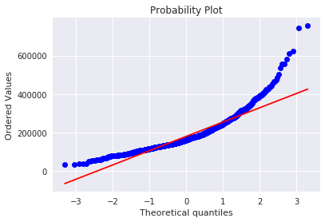

```python
import numpy as np
import math
import pandas as pd
import seaborn as sns
import matplotlib.pyplot as plt
from dateutil import parser, relativedelta
from IPython.display import display

pd.options.mode.chained_assignment = None  # default='warn'

def x_translation (x_ver, row):
    x_ch = row['x']
    x_n = x_ch - x_ver
    return  x_n

def z_translation (z_ver, row):
    z_ch = row['z']
    z_n = z_ch - z_ver
    return z_n

# calculate arc that the body needs to rotate to get both shoulders on the same z-coordinate
def define_arc(frame):
    x_left = frame.loc[frame['jointName'] == "ShoulderLeft", 'xToOrigin'].values[0]
    z_left = frame.loc[frame['jointName'] == "ShoulderLeft", 'zToOrigin'].values[0]
    arc = math.atan(abs(z_left)/abs(x_left))
    return arc

# rotate a given point and calculate new x and new z
def rotate_body_x(row, arc):
    new_x = (math.cos(arc) * float(row['xToOrigin'])) - (math.sin(arc) * float(row['zToOrigin']))
    return new_x

def rotate_body_z(row, arc):
    new_z = (math.cos(arc) * float(row['zToOrigin'])) + (math.sin(arc) * float(row['xToOrigin'])) 
    return new_z

def rotate_body(df):
    # create empty DataFrame
    index = np.arange(0)
    frames = pd.DataFrame(index=index)
    frames = frames.fillna(0) # with 0s rather than NaNs

    # get frames from one exercise
    frame_max = int(df['frameNum'].max())
    frame_min = int(df['frameNum'].min())
    
    # go through all frames of an exercise
    for i in range(frame_min, frame_max):   
        frame = df.loc[df['frameNum'] == i]

        # define translation to place vectors in origin
        x_ver = frame.x.where(frame.jointName == "ShoulderRight").dropna()
        z_ver = frame.z.where(frame.jointName == "ShoulderRight").dropna()
        
        x_ver = x_ver.values[0]
        z_ver = z_ver.values[0]

        # translate
        frame['xToOrigin'] = frame.apply(lambda row: x_translation(x_ver, row),axis=1)
        frame['zToOrigin'] = frame.apply(lambda row: z_translation(z_ver, row),axis=1)

        zShoulderRight = frame.loc[frame['jointName'] == "ShoulderRight", 'z']
        zShoulderLeft = frame.loc[frame['jointName'] == "ShoulderLeft", 'z']

        # decide if the body clockwise or counterclockwise rotation needs
        if zShoulderRight.values[0] < zShoulderLeft.values[0]:
            # rotate clockwise
            clock = 1
        else:
            # rotate - clockwise
            clock = -1

        #rotate body
        arc = define_arc(frame)
        frame['xRotated'] = frame.apply (lambda row: rotate_body_x(row, arc * clock),axis=1)
        frame['zRotated'] = frame.apply (lambda row: rotate_body_z(row, arc * clock),axis=1)

        frames = frames.append(frame)    
    return frames


# # Arcs in exercises

# In[114]:

def calculate_arc(frame, eNum, side):  
    een = [1, 4, 5]
    twee = [2, 6, 7]
    drie = [3, 8, 9]
    
    # which exercise is done in the given dataframe
    if (eNum in een) or (eNum in twee):
        # which coördinate is needed for the desired arc
        if eNum in een:
            coordinate_one = 'xRotated'
            coordinate_two = 'y'
        elif eNum in twee:
            coordinate_one = 'y'
            coordinate_two = 'zRotated'
        
        # neemt eerste waarde, hoeft niet de goede waarde te zijn!!
        spineShoulder = np.matrix([[frame.loc[frame['jointName'] == 'SpineShoulder', coordinate_one].values[0]], 
                               [frame.loc[frame['jointName'] == 'SpineShoulder', coordinate_two].values[0]]])
        spineMid = np.matrix([[frame.loc[frame['jointName'] == 'SpineMid', coordinate_one].values[0]], 
                               [frame.loc[frame['jointName'] == 'SpineMid', coordinate_two].values[0]]])
        spineMid_new = spineMid - spineShoulder
        
        if side == 'l':
            # left side
            jointName_shoulder = "ShoulderLeft"
            jointName_elbow = "ElbowLeft"
        elif side == 'r':
            # right side
            jointName_shoulder = "ShoulderRight"
            jointName_elbow = "ElbowRight"
        
        shoulder = np.matrix([[frame.loc[frame['jointName'] == jointName_shoulder, coordinate_one].values[0]], 
                        [frame.loc[frame['jointName'] == jointName_shoulder, coordinate_two].values[0]]])
        elbow = np.matrix([[frame.loc[frame['jointName'] == jointName_elbow, coordinate_one].values[0]], 
                        [frame.loc[frame['jointName'] == jointName_elbow, coordinate_two].values[0]]])
        elbow_new = elbow - shoulder
        
        sum_vectors = np.dot(np.transpose(spineMid_new), elbow_new)
        multiplication_lengths = np.linalg.norm(spineMid_new) * np.linalg.norm(elbow_new)
        
    else:
        if side == 'r':
            # right side
            jointName_elbow = "ShoulderRight"
            jointName_wrist = "WristRight"
        else:
            # left side
            jointName_elbow = "ShoulderLeft"
            jointName_wrist = "WristLeft"
            
        elbow = np.matrix([[frame.loc[frame['jointName'] == jointName_elbow, 'xRotated'].values[0]], 
                            [frame.loc[frame['jointName'] == jointName_elbow, 'zRotated'].values[0]]])
        wrist = np.matrix([[frame.loc[frame['jointName'] == jointName_wrist, 'xRotated'].values[0]], 
                            [frame.loc[frame['jointName'] == jointName_wrist, 'zRotated'].values[0]]])
        
        wrist_new = wrist - elbow
        front_vector = np.matrix([[0],[-1]])

        sum_vectors = np.dot(np.transpose(front_vector), wrist_new)
        multiplication_lengths = np.linalg.norm(front_vector) * np.linalg.norm(wrist_new)
    
    cos_alpha = sum_vectors / multiplication_lengths
    alpha = np.arccos(cos_alpha) * 180 / math.pi
    
    if eNum in een:
        if side == 'r':
            if elbow_new[0,0] < spineMid_new[0,0]:
                alpha = 360 - alpha
        else:
            if elbow_new[0,0] > spineMid_new[0,0]:
                alpha = 360 - alpha
    elif eNum in twee:
        # Waarmee vergelijken?????????????????????
        if (elbow_new[0,0] > 0) and (elbow_new[1,0] > 0):
            alpha = 360 - alpha
                
    return alpha     

def get_arcs(df, pNum, eNum, side):
#     df = df.loc[df['eNum'] == eNum]
    
    frame_max = int(df['frameNum'].max())
    frame_min = int(df['frameNum'].min())
    # arcs = arcs.fillna(0) # with 0s rather than NaNs

    if side == 'lr':
        columns = ['pNum','eNum', 'frameNum', 'arc_right', 'arc_left']
        arcs = pd.DataFrame(index=np.arange(0), columns=columns).fillna(0)

        for i in range(frame_min, frame_max + 1): 
            frame = df.loc[df['frameNum'] == i]

            right_arc = calculate_arc(frame, eNum, 'r')
            left_arc = calculate_arc(frame, eNum, 'l')

            row = {'pNum':pNum, 'eNum':eNum, 'frameNum': i, 'arc_right': right_arc[0,0], 'arc_left': left_arc[0,0]}
            arcs = arcs.append(row, ignore_index=True)            

    else:
        columns = ['pNum', 'eNum', 'frameNum', 'arc']
        arcs = pd.DataFrame(index=np.arange(0), columns=columns)

        for i in range(frame_min, frame_max + 1): 
            frame = df.loc[df['frameNum'] == i]

            arc = calculate_arc(frame, eNum, side)
            
            row = {'pNum':pNum, 'eNum':eNum, 'frameNum': i, 'arc': arc[0,0]}
            arcs = arcs.append(row, ignore_index=True)            

    return arcs

def relative_time(df, row, first_frame):
    if row == first_frame:
        return 0
    
    time_row = df.loc[df['frameNum'] == row, 'time']
    time_row = time_row.iloc[0]
    time_first_frame = df.loc[df['frameNum'] == first_frame, 'time']
    time_first_frame = time_first_frame.iloc[0]
    
    dt1 = parser.parse(time_row)
    dt2 = parser.parse(time_first_frame)
    delta = relativedelta.relativedelta(dt1, dt2)
    microseconds = delta.seconds * 1000000 + delta.microseconds
    return microseconds

def normalized_time(row, frame):
    total_time = frame['relativeTime'].max()
    
    relative_time = row['relativeTime']
    normalized = relative_time/total_time
    return normalized

def normalize_time(df, eNum, side):
    columns = ['frameNum', 'relativeTime']
    times = pd.DataFrame(index=np.arange(0), columns=columns).fillna(0)
    
    frame_max = int(df['frameNum'].max())
    frame_min = int(df['frameNum'].min())
#     df = df.loc[df['eNum'] == eNum]
    
    for i in range(frame_min, frame_max + 1):
        time_relative = relative_time(df, i, frame_min)
        row = {'frameNum': int(i), 'relativeTime': time_relative}
        times = times.append(row, ignore_index=True)
    
    times['normalized'] = times.apply (lambda row: normalized_time(row, times), axis=1)
    return times

def create_plot(arcs, times, side):
    if side == 'lr':
        plt.plot(times['normalized'], arcs['arc_left'])
        plt.plot(times['normalized'], arcs['arc_right'])

        plt.xlabel('tijd (relatief)')
        plt.ylabel('graden')
        plt.ylim((0,240))
        plt.legend()
        plt.show()
```


```python
import numpy as np
import math
import pandas as pd
import seaborn as sns
import matplotlib.pyplot as plt
from dateutil import parser, relativedelta
from IPython.display import display
from scipy.stats.stats import pearsonr


pd.options.mode.chained_assignment = None  # default='warn'

def getValidPersonData(df, pNum, eNum, startFrame, endFrame):
    return df[(df.pNum == pNum) & (df.eNum == eNum) & (df.frameNum >= startFrame) & (df.frameNum <= endFrame)]

def cleanData(df, exercises):
    filteredDataFrame = pd.DataFrame()
    
    for index, row in exercises.iterrows():
        validData = getValidPersonData(df, row.Person, row.Exercise, row.StartFrame, row.FinalFrame)
        if not np.isnan(row.NewExercise):
            validData.eNum = int(row.NewExercise)
        filteredDataFrame = filteredDataFrame.append(validData)
    return filteredDataFrame    

def cleanFile(dataFilename, excelFilename):
    filteredDataFrame = pd.DataFrame()
    combinedData = pd.read_csv(dataFilename)
    excel = pd.ExcelFile(excelFilename)
    excelSheetList = [1, 2, 3, 1.1, 1.2, 2.1, 2.2, 3.1, 3.2]
    for i in excelSheetList:
        exercise = excel.parse("Sheet"+str(i))
        filteredDataFrame = filteredDataFrame.append(cleanData(combinedData, exercise))
        
    print(filteredDataFrame.pNum.unique())
    if(combinedData.pNum.max() > filteredDataFrame.pNum.max()):
        validDataSize = filteredDataFrame.pNum.max()
        for person in range(validDataSize, combinedData.pNum.max() + 1):
            filteredDataFrame = filteredDataFrame.append(combinedData[(combinedData.pNum == person)])
    
    return filteredDataFrame

def getCleanedCombinedData():
    return cleanFile('/data/pepper/combined_single_plus_zuiderpark.csv', '/home/13040367/notebooks/ValidData.xlsx')
```


```python
df = getCleanedCombinedData()
```


```python
df = pd.read_csv('/data/pepper/zuiderpark_combined_fixed.csv')
```


```python
def get_arcs_without_rotation(df, pNum, eNum, side):
#     df = df.loc[df['eNum'] == eNum]
    
    frame_max = int(df['frameNum'].max())
    frame_min = int(df['frameNum'].min())
    # arcs = arcs.fillna(0) # with 0s rather than NaNs

    if side == 'lr':
        columns = ['pNum','eNum', 'frameNum', 'arc_right', 'arc_left']
        arcs = pd.DataFrame(index=np.arange(0), columns=columns).fillna(0)

        for i in range(frame_min, frame_max + 1): 
            frame = df.loc[df['frameNum'] == i]

            right_arc = calculate_arc_without_rotation(frame, eNum, 'r')
            left_arc = calculate_arc_without_rotation(frame, eNum, 'l')

            row = {'pNum':pNum, 'eNum':eNum, 'frameNum': i, 'arc_right': right_arc[0,0], 'arc_left': left_arc[0,0]}
            arcs = arcs.append(row, ignore_index=True)            

    else:
        columns = ['pNum', 'eNum', 'frameNum', 'arc']
        arcs = pd.DataFrame(index=np.arange(0), columns=columns)

        for i in range(frame_min, frame_max + 1): 
            frame = df.loc[df['frameNum'] == i]

            arc = calculate_arc_without_rotation(frame, eNum, side)
            
            row = {'pNum':pNum, 'eNum':eNum, 'frameNum': i, 'arc': arc[0,0]}
            arcs = arcs.append(row, ignore_index=True)            

    return arcs

def calculate_arc_without_rotation(frame, eNum, side):  
    een = [1, 4, 5]
    twee = [2, 6, 7]
    drie = [3, 8, 9]
    
    # which exercise is done in the given dataframe
    if (eNum in een) or (eNum in twee):
        # which coördinate is needed for the desired arc
        if eNum in een:
            coordinate_one = 'x'
            coordinate_two = 'y'
        elif eNum in twee:
            coordinate_one = 'y'
            coordinate_two = 'z'
        
        # neemt eerste waarde, hoeft niet de goede waarde te zijn!!
        spineShoulder = np.matrix([[frame.loc[frame['jointName'] == 'SpineShoulder', coordinate_one].values[0]], 
                               [frame.loc[frame['jointName'] == 'SpineShoulder', coordinate_two].values[0]]])
        spineMid = np.matrix([[frame.loc[frame['jointName'] == 'SpineMid', coordinate_one].values[0]], 
                               [frame.loc[frame['jointName'] == 'SpineMid', coordinate_two].values[0]]])
        spineMid_new = spineMid - spineShoulder
        
        if side == 'l':
            # left side
            jointName_shoulder = "ShoulderLeft"
            jointName_elbow = "ElbowLeft"
        elif side == 'r':
            # right side
            jointName_shoulder = "ShoulderRight"
            jointName_elbow = "ElbowRight"
        
        shoulder = np.matrix([[frame.loc[frame['jointName'] == jointName_shoulder, coordinate_one].values[0]], 
                        [frame.loc[frame['jointName'] == jointName_shoulder, coordinate_two].values[0]]])
        elbow = np.matrix([[frame.loc[frame['jointName'] == jointName_elbow, coordinate_one].values[0]], 
                        [frame.loc[frame['jointName'] == jointName_elbow, coordinate_two].values[0]]])
        elbow_new = elbow - shoulder
        
        sum_vectors = np.dot(np.transpose(spineMid_new), elbow_new)
        multiplication_lengths = np.linalg.norm(spineMid_new) * np.linalg.norm(elbow_new)
        
    else:
        if side == 'r':
            # right side
            jointName_elbow = "ShoulderRight"
            jointName_wrist = "WristRight"
        else:
            # left side
            jointName_elbow = "ShoulderLeft"
            jointName_wrist = "WristLeft"
            
        elbow = np.matrix([[frame.loc[frame['jointName'] == jointName_elbow, 'x'].values[0]], 
                            [frame.loc[frame['jointName'] == jointName_elbow, 'z'].values[0]]])
        wrist = np.matrix([[frame.loc[frame['jointName'] == jointName_wrist, 'x'].values[0]], 
                            [frame.loc[frame['jointName'] == jointName_wrist, 'z'].values[0]]])
        
        wrist_new = wrist - elbow
        front_vector = np.matrix([[0],[-1]])

        sum_vectors = np.dot(np.transpose(front_vector), wrist_new)
        multiplication_lengths = np.linalg.norm(front_vector) * np.linalg.norm(wrist_new)
    
    cos_alpha = sum_vectors / multiplication_lengths
    alpha = np.arccos(cos_alpha) * 180 / math.pi
    
    if eNum in een:
        if side == 'r':
            if elbow_new[0,0] < spineMid_new[0,0]:
                alpha = 360 - alpha
        else:
            if elbow_new[0,0] > spineMid_new[0,0]:
                alpha = 360 - alpha
    elif eNum in twee:
        # Waarmee vergelijken?????????????????????
        if (elbow_new[0,0] > 0) and (elbow_new[1,0] > 0):
            alpha = 360 - alpha
                
    return alpha     
```


```python
# without rotation!

eNum = 3
side = 'lr'
all_arcs = pd.DataFrame()

for p in range(71, 75+1):  #86
    print(p)
    if not df.empty:
        one_person = df.loc[df['pNum'] == p]
        one_person = one_person.loc[one_person['eNum'] == eNum]
        arcs_person = get_arcs_without_rotation(one_person, p, eNum, side)
        all_arcs = all_arcs.append(arcs_person)
    
print(all_arcs)
```

    71
    72
    73
    74
    75
         pNum  eNum  frameNum  arc_right   arc_left
    0    71.0   3.0       1.0  29.891089  46.136461
    1    71.0   3.0       2.0  31.257961  46.830690
    2    71.0   3.0       3.0  31.108216  47.162762
    3    71.0   3.0       4.0  31.532679  46.913477
    4    71.0   3.0       5.0  32.046690  46.671650
    5    71.0   3.0       6.0  32.695087  46.284885
    6    71.0   3.0       7.0  33.622741  45.423372
    7    71.0   3.0       8.0  33.497313  44.803080
    8    71.0   3.0       9.0  33.732959  45.177656
    9    71.0   3.0      10.0  33.353003  44.705061
    10   71.0   3.0      11.0  33.177118  44.167996
    11   71.0   3.0      12.0  31.358806  44.027346
    12   71.0   3.0      13.0  29.926135  43.925797
    13   71.0   3.0      14.0  26.726806  43.698074
    14   71.0   3.0      15.0  26.852400  44.040638
    15   71.0   3.0      16.0  24.622198  44.297737
    16   71.0   3.0      17.0  25.133358  44.806281
    17   71.0   3.0      18.0  25.242484  45.002397
    18   71.0   3.0      19.0  25.017887  45.441676
    19   71.0   3.0      20.0  25.492576  45.890433
    20   71.0   3.0      21.0  26.277226  46.122945
    21   71.0   3.0      22.0  26.116408  46.364093
    22   71.0   3.0      23.0  25.634808  48.552235
    23   71.0   3.0      24.0  24.999203  48.810622
    24   71.0   3.0      25.0  23.974848  48.360519
    25   71.0   3.0      26.0  23.651594  47.861295
    26   71.0   3.0      27.0  22.474833  46.760069
    27   71.0   3.0      28.0  21.626300  47.563004
    28   71.0   3.0      29.0  20.599092  46.948330
    29   71.0   3.0      30.0  19.343891  45.630923
    ..    ...   ...       ...        ...        ...
    535  75.0   3.0     536.0   9.266048   3.673506
    536  75.0   3.0     537.0   6.414325   3.652336
    537  75.0   3.0     538.0   4.667602   3.517831
    538  75.0   3.0     539.0   3.280599   3.624463
    539  75.0   3.0     540.0   2.151623   7.803521
    540  75.0   3.0     541.0   0.189223   7.718690
    541  75.0   3.0     542.0   0.123487   6.899776
    542  75.0   3.0     543.0   3.226625   6.600336
    543  75.0   3.0     544.0   1.669777   1.392669
    544  75.0   3.0     545.0   6.727768   1.076382
    545  75.0   3.0     546.0   3.622571   0.944469
    546  75.0   3.0     547.0   3.777989   5.288045
    547  75.0   3.0     548.0   4.572878   5.112594
    548  75.0   3.0     549.0   4.820366   4.953747
    549  75.0   3.0     550.0   4.861499   4.852782
    550  75.0   3.0     551.0   4.781618   0.197295
    551  75.0   3.0     552.0   4.482512   4.646595
    552  75.0   3.0     553.0   3.599322   4.618995
    553  75.0   3.0     554.0   3.666624   0.930774
    554  75.0   3.0     555.0   3.608873   0.963306
    555  75.0   3.0     556.0   5.006561   0.985519
    556  75.0   3.0     557.0   5.036748   0.915018
    557  75.0   3.0     558.0   4.701137   1.112872
    558  75.0   3.0     559.0   4.765807   0.024843
    559  75.0   3.0     560.0   4.811794   0.032149
    560  75.0   3.0     561.0   2.653314   0.551499
    561  75.0   3.0     562.0   2.688315   0.460904
    562  75.0   3.0     563.0   4.589971   4.371802
    563  75.0   3.0     564.0   4.616291   0.143095
    564  75.0   3.0     565.0   3.179461   4.294209
    
    [3036 rows x 5 columns]


```python
all_arcs.to_csv('arcs_for_maricruz.csv')
```


```python
person_76_1 = pd.read_csv('30-Nov-17 09_47_03.csv')
person_76_2 = pd.read_csv('30-Nov-17 09_47_25.csv')
person_76_3 = pd.read_csv('30-Nov-17 09_47_44.csv')
person_67_1 = pd.read_csv('30-Nov-17 08_57_39.csv')
person_71_1 = pd.read_csv('30-Nov-17 09_07_38.csv')
person_72_1 = pd.read_csv('30-Nov-17 09_30_38.csv')
person_73_1 = pd.read_csv('30-Nov-17 09_32_06.csv')
person_74_1 = pd.read_csv('30-Nov-17 09_40_23.csv')
```


```python
# framed_person_76 = person_76.loc[person_76['frameNum'] > 128]
# framed_person_76 = framed_person_76.loc[framed_person_76['frameNum'] < 304]
```


```python
p = 73
eNum = 1
side = 'lr'

rotated = rotate_body(person_73_1)
arcs_person = get_arcs(rotated, p, eNum, side)
norm_times = normalize_time(rotated, eNum, side)
create_plot(arcs_person, norm_times, side)
```

    /opt/jupyterhub/anaconda/lib/python3.6/site-packages/matplotlib/font_manager.py:1316: UserWarning: findfont: Font family ['sans-serif'] not found. Falling back to DejaVu Sans
      (prop.get_family(), self.defaultFamily[fontext]))





```python
p = 74
eNum = 1
side = 'lr'

rotated = rotate_body(person_74_1)
arcs_person = get_arcs(rotated, p, eNum, side)
norm_times = normalize_time(rotated, eNum, side)
create_plot(arcs_person, norm_times, side)
```


```python
p = 76
eNum = 2
side = 'lr'

rotated = rotate_body(person_76)
arcs_person = get_arcs(rotated, p, eNum, side)
norm_times = normalize_time(rotated, eNum, side)
create_plot(arcs_person, norm_times, side)
```


```python
p = 76
eNum = 3
side = 'lr'

rotated = rotate_body(person_76)
arcs_person = get_arcs(rotated, p, eNum, side)
norm_times = normalize_time(rotated, eNum, side)
create_plot(arcs_person, norm_times, side)
```
